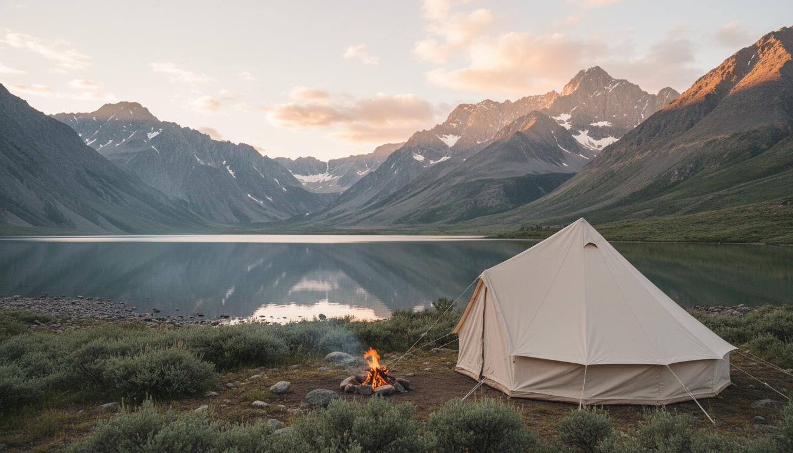
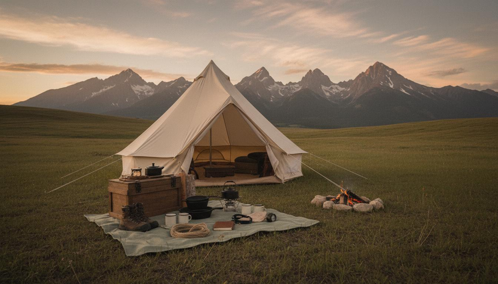
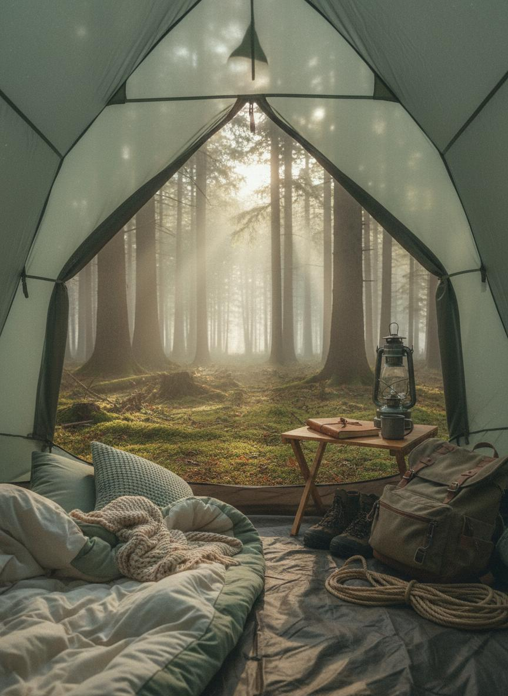
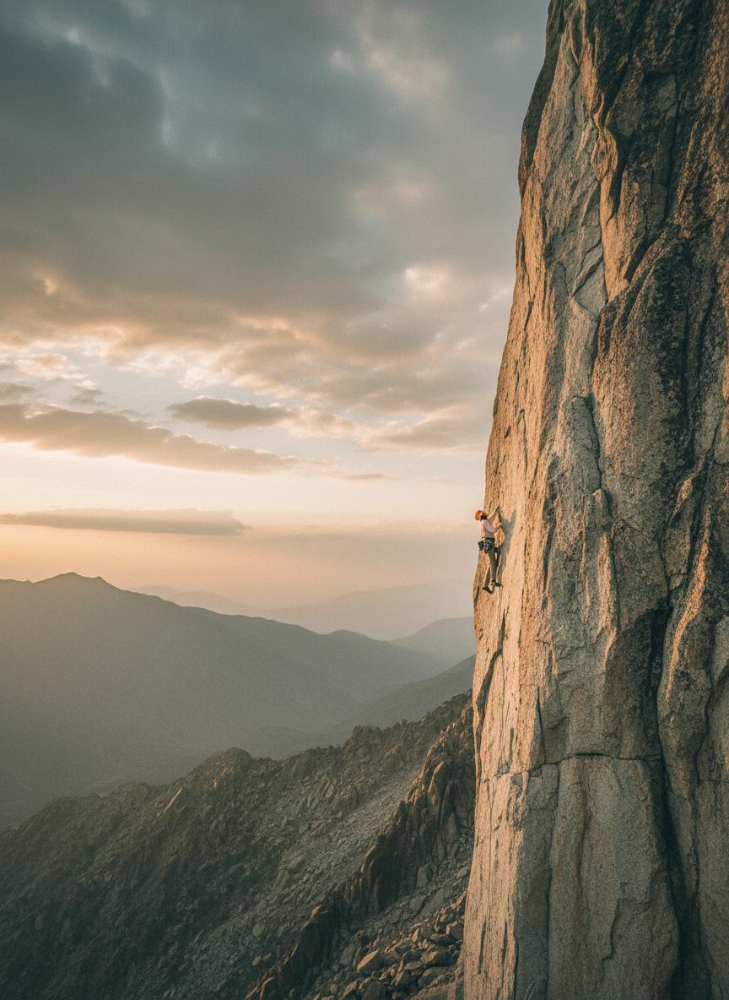
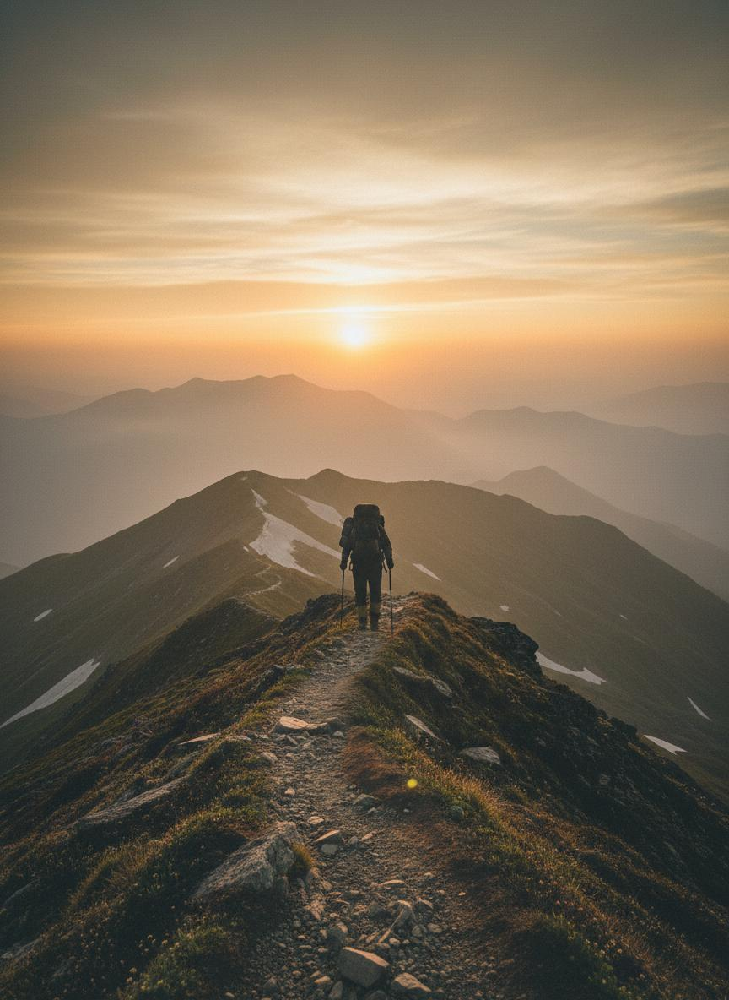

<div align="center">
  

  # Trekify

  ### Travel Light. Camp Right.

  Premium camping and outdoor gear rentals with destination-first planning and clean, modern UX.

  [](https://rahul-panda564.github.io/Trekify/)
  [](LICENSE)
  [](#stack)

</div>

## Overview
Trekify helps people rent premium outdoor gear instead of buying expensive one-time-use equipment.

You can browse kits, explore destinations, compare value, and plan your next trip faster.

## Highlights
- Curated gear catalog with clean pricing cards and clear call-to-actions.
- Destination explorer with visual-first discovery.
- Fully responsive UI for desktop, tablet, and mobile.
- Lightweight static deployment for fast load times.

## Screenshots
<p align="center">
  
  
</p>
<p align="center">
  
  
  
</p>

## Stack
- React
- Vite
- CSS

## Run Locally
1. Clone the project.
```bash
git clone https://github.com/Rahul-panda564/Trekify.git
cd Trekify
```

2. Serve the static site.
```bash
npx serve . -p 3000
```

3. Open in browser.
```text
http://localhost:3000
```

## Deploy to GitHub Pages (main / root)
1. Push your code to GitHub.
2. Open repository settings.
3. Go to Pages.
4. Set Source to Deploy from a branch.
5. Choose Branch: main.
6. Choose Folder: / (root).
7. Save and wait for GitHub Pages to publish.

## Project Structure
```text
Trekify/
|-- assets/
|   |-- main.js
|   `-- styles.css
|-- images/
|-- index.html
|-- LICENSE
`-- README.md
```

## License
This project is licensed under the MIT License. See the LICENSE file for details.

<div align="center">
  Built for adventurers from Berhampur, Odisha.
</div>
